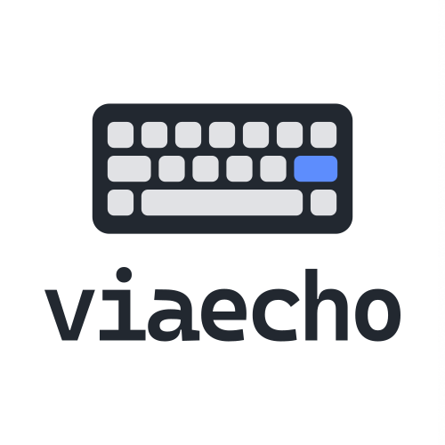
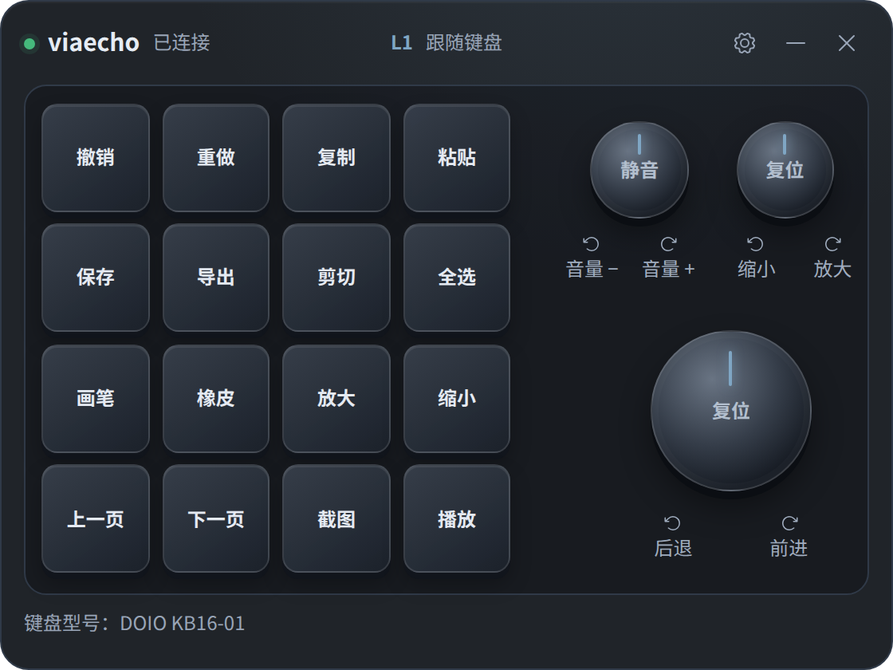
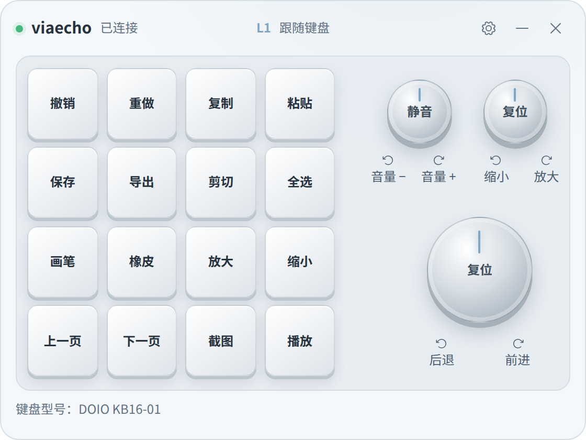
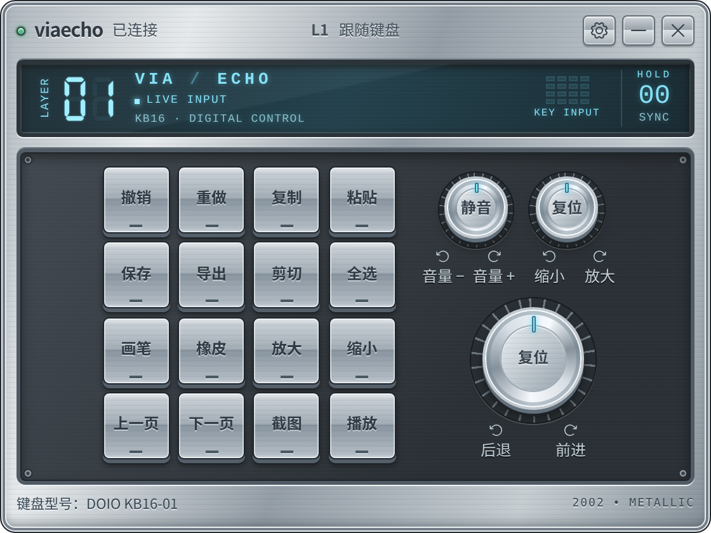
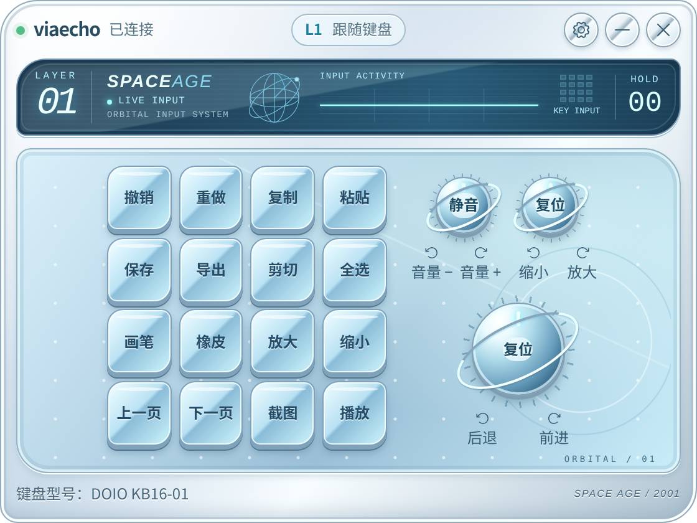
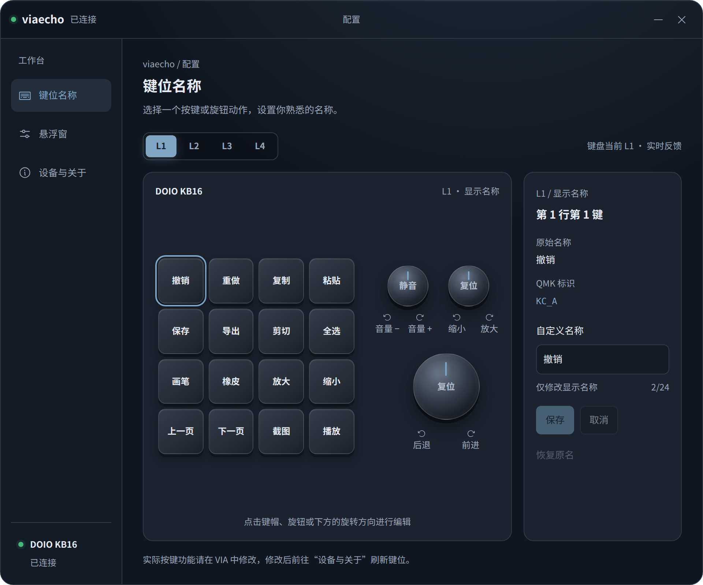

<p align="center">
  
</p>

# viaecho

为 **DOIO KB16（KB16-01）** 开发的 Windows 悬浮键位提示器，把键盘每一层的功能放到屏幕上，忘记时看一眼就能继续使用。

## 为什么开发它

这个项目起源于我买了一把 DOIO KB16。它只有 16 个按键，却有 4 层配置，光普通按键就有 **4 × 16 = 64 个键位绑定**，还不包括三个旋钮的按压和旋转功能。

功能可以设得很多，但使用时很难记清每一层的键位。在键盘上标注也不太现实：同一个按键在不同层有不同用途，调整配置后还得重新标注。

所以我做了 viaecho，用一个悬浮窗显示键位，让这把键盘更容易记、更方便用。它的设计围绕这个需求展开：布局对应实体键盘，功能名称可以自己填写，提示窗可以置顶、调整透明度、闲置时变淡，也可以开启鼠标穿透，尽量减少对日常工作的干扰。

**目前仅支持 DOIO KB16，其他键盘暂未开发，也没有适配安排。**

## 简单介绍

- 从 VIA 读取四层键位，展示按键和三个旋钮的功能。
- 按层设置易懂的显示名称，例如“撤销”“导出”“切换工具”。
- 配合本项目固件，自动跟随当前层，并显示按键、旋钮的实时反馈。
- 支持外观切换、托盘操作和设备自动重连。

viaecho 负责显示提示；实际键位和快捷键仍在 VIA 中设置。原厂固件也可读取键位、手动查看各层，自动跟层与实时反馈需要刷入配套固件。

## 程序预览

下图由当前界面代码渲染，使用示例键位和模拟连接状态展示布局；实际名称与反馈取决于你的 VIA 配置和固件。

| 深色 | 亮色 |
| --- | --- |
|  |  |

| Y2K Metallic | Y2K Space Age |
| --- | --- |
|  |  |

**键位名称配置**：选择层、按键或旋钮功能，编辑自己的提示名称。



**设备与关于**：查看设备状态、刷新 VIA 键位和应用信息。


## 怎么使用

1. **连接键盘，启动 viaecho。** 应用会自动连接设备，读取键位并显示悬浮窗。
2. **查看每一层。** 刷入配套固件后，提示会随键盘切层；使用原厂固件时，可手动切换 L1–L4 查看。
3. **填写功能名称。** 点击齿轮或从托盘打开配置，在“键位名称”中选择层，再点击对应的按键或旋钮功能，填写名称并保存。这只修改提示文字。
4. **调整显示。** 在“悬浮窗”中设置皮肤、透明度、置顶、闲置变淡和鼠标穿透。开启穿透后，可从托盘解除。
5. **同步改键。** 在 VIA 中修改键位后，到“设备与关于”点击“刷新 VIA 键位”。

关闭配置窗后，提示窗仍会运行；关闭悬浮窗或从托盘选择“退出”会结束应用。

## 配套固件与刷写

配套固件保留 VIA 改键功能，并增加自动跟层和实时操作反馈。KB16 有两个硬件版本，**刷写前需要确认主控芯片，选择对应固件**：

| 硬件版本 | 主控芯片 | 配套固件 |
| --- | --- | --- |
| rev1 | ATmega32U4 | [rev1 固件（.hex）](firmware/qmk_userspace/doio_kb16_rev1_via_echo.hex) |
| rev2 | APM32F103CBT6（QMK 按 STM32F103 构建） | [rev2 固件（.bin）](firmware/qmk_userspace/doio_kb16_rev2_via_echo.bin) |

可以查看 PCB 版本丝印和主控芯片上的型号，也可以在进入引导模式后查看 QMK Toolbox 的识别信息：rev1 显示 `Atmel DFU / ATmega32U4`，rev2 显示 `STM32Duino / LeafLabs Maple`。这些对应关系来自 [QMK 官方硬件说明](https://github.com/qmk/qmk_firmware/blob/master/keyboards/doio/kb16/readme.md)。无法确认版本时，先不要刷写；两个版本的固件不能混用。

刷写步骤：

1. 在 VIA 中导出并保存当前配置。刷写后键位可能恢复默认，需要用备份还原。
2. 下载上表中与主控芯片对应的固件，打开 QMK Toolbox。
3. 通过 PCB 复位按钮或已设置的 `QK_BOOT` 键位进入引导模式，确认 Toolbox 识别的设备版本。
4. 选择对应固件并刷写，完成后重新插拔键盘。
5. 在 VIA 中导入备份，再启动 viaecho，检查切层、按键和三个旋钮的反馈。

固件构建、详细刷写步骤和恢复原固件的方法见 [固件说明](firmware/README.md)。

## 从源码运行

项目使用 React、TypeScript 和 Tauri 2。准备好 Node.js、Rust 与 Tauri 开发环境后运行：

```bash
npm ci
npm run tauri dev
```

构建安装包：`npm run tauri build`。

## 许可证

Copyright (c) 2026 hwangzhun。

viaecho 桌面应用及本项目原创文档和素材采用 **GNU General Public License v3.0（仅第 3 版，`GPL-3.0-only`）**，完整条款见 [LICENSE](LICENSE)。第三方代码和素材仍遵循各自的许可证。

允许学习、修改、分享和商业使用，包括收费销售。分发原版或二次开发后的程序时，必须保留原有版权和许可声明，修改版应标明修改及日期，并按 GPLv3 的要求向程序接收者提供完整对应源码，包括修改部分及必要的构建、安装脚本。受 GPL 覆盖的衍生程序必须整体按 GPLv3 发布，接收者仍享有修改和再分发的权利。软件按原样提供，不附带担保；具体权利和义务以许可证全文为准。

配套 QMK 固件的许可范围见 [固件说明](firmware/README.md#许可证)。固件源码保留原有的 `GPL-2.0-or-later` 声明及上游作者署名，不受桌面应用的 `GPL-3.0-only` 限定替代。

本次协议变更不追溯撤销历史版本的授权。此前已按 MIT 发布的版本（包括 v0.2.0 和 v0.3.0）仍可按其发布时的 MIT 许可证使用；相应条款见各历史版本中的 `LICENSE`。
